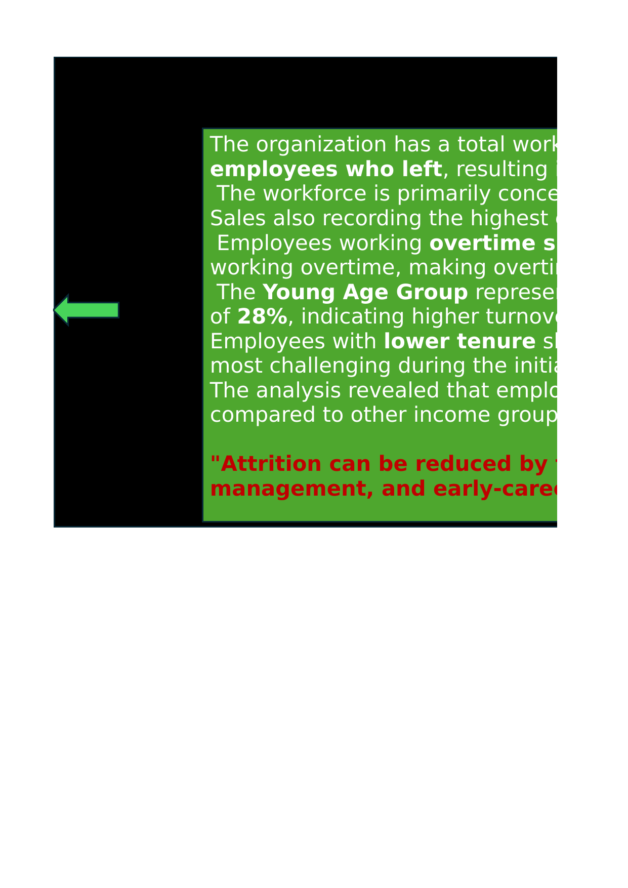
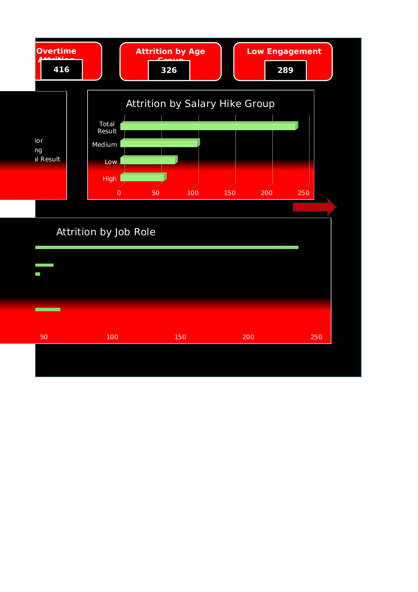

# Hiring & Attrition Analysis (Excel Dashboard)

An end-to-end Excel project that analyzes employee **hiring** and **attrition** patterns for an organization of 1,470 employees, using pivot tables, slicers, and interactive dashboards to uncover the key drivers of employee turnover.

## 📌 Objective

The main objective of this project was to understand the hiring and attrition pattern in the organization — identifying which employees were leaving, which departments were most affected, and what factors (salary, overtime, experience, job satisfaction) contributed most to attrition. The goal was to convert raw HR data into actionable insights that HR teams can use to improve employee retention.

## 🗂️ Dataset

The dataset (`employee_data.csv` / `Hiring-Attrition.xlsx`) contains **1,470 employee records** with **29 attributes**, including:

- **Demographics:** Age, Gender, Marital Status, Distance From Home
- **Job details:** Department, Job Role, Job Level, Education, Education Field
- **Compensation:** Monthly Income, Percent Salary Hike, Income Group
- **Experience:** Total Working Years, Years at Company, Years in Current Role, Years Since Last Promotion, Years With Current Manager, Number of Companies Worked
- **Engagement scores:** Environment Satisfaction, Job Involvement, Job Satisfaction, Relationship Satisfaction, Work-Life Balance
- **Work conditions:** OverTime
- **Target variable:** Attrition (Yes/No)

Helper columns were engineered for grouped analysis: `Attrition Flag`, `Age Group`, `Income Group`, `Tenure Group`, `Salary Hike Group`.

## 🛠️ Approach / Planning

1. **Data collection & cleaning** — Collected the HR dataset, removed duplicates, cleaned the data, and converted it into an Excel Table.
2. **Feature engineering** — Created helper columns (Age Group, Income Group, Tenure Group, Salary Hike Group) to enable grouped, segment-level analysis.
3. **KPI definition** — Defined key KPIs: Total Employees, Active Employees, Attrition Count, Attrition Rate.
4. **Dashboard building** — Built two interactive dashboards (Hiring Analysis and Attrition Analysis) using PivotTables, PivotCharts, and Slicers.
5. **Insight generation** — Analyzed employee segments (department, income group, age group, tenure, overtime) to identify the major drivers of attrition and translated the findings into business recommendations.

## 📊 Workbook Structure

| Sheet | Description |
|---|---|
| `Hiring-Attrition` | Raw dataset (1,470 rows × 29 columns) |
| `Hiring ` | Hiring summary / pivot metrics |
| `Attrition` | Attrition summary / pivot metrics |
| `INTRO` | Project introduction |
| `P&O` | Planning & Objective |
| `DASH1` | Hiring Analysis dashboard |
| `DASH2` | Attrition Analysis dashboard |
| `INSIGHT` | Key insights & recommendations |

The workbook uses **20 PivotTables** and **10 PivotCharts/Slicers** to power the two dashboards.

## 📈 Dashboards

### Hiring Analysis

- Total Employees: **882** (active headcount view) | Average Age: **37**
- Gender-wise, Department-wise, and Age Group-wise employee distribution
- Employee distribution by Job Role and Education Field

### Attrition Analysis

- Total Employees: **1,470** | Total Attrition: **237** | Overtime Attrition: **416** | Attrition by Age Group: **326** | Low Engagement Attrition: **289**
- Attrition broken down by Department, Age Group, Income Group, Salary Hike Group, and Job Role
- Fully interactive via slicers (Attrition, OverTime, Age Group, Job Satisfaction)

## 💡 Key Insights

- The organization has a total workforce of **1,470 employees**, with **1,233 active** employees and **237** who left — an overall **attrition rate of 16%**.
- The workforce is primarily concentrated in **Research & Development** and **Sales**, with **Sales** also recording the highest employee turnover among all departments.
- Employees working **overtime** showed an attrition rate of **31%**, compared to only **10%** for employees not working overtime — making overtime the most significant factor influencing attrition.
- The **Young Age Group** represents a major portion of the workforce and also recorded the highest attrition rate, at **28%** — indicating higher turnover among early-career employees.
- Employees with **lower tenure** showed the highest attrition rate, at **30%**, suggesting retention is most challenging in the initial years of employment.
- Employees in the **Low Income Group** experienced higher attrition (**22%**) compared to other income groups, highlighting compensation as an important retention factor.

> **"Attrition can be reduced by focusing on employee satisfaction, fair compensation, workload management, and early-career retention strategies."**

## 🧰 Tools Used

- Microsoft Excel — PivotTables, PivotCharts, Slicers, helper columns, dashboard design

## 📁 Repository Structure
